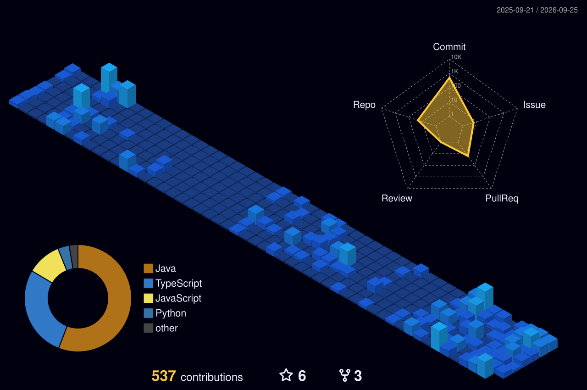

<h1 align="center">Hi 👋, I'm Nikshep D</h1>
<h3 align="center">CS(AIML) student at NIE Mysore | DSA (Java) & Spring Boot Backend | Building impactful projects 🚀</h3>

---

- 🌱 I’m currently learning: Data Structures & Algorithms (Java), Spring Boot backend development, and Machine Learning (Python)

- 👯 I’m looking to collaborate on: Innovative student projects, hackathons, and open-source contributions

- 💬 Ask me about: DSA in Java, Spring Boot backend, and beginner AI/ML concepts

- 📫 How to reach me: nikshepd01@gmail.com

## 🛠️ Skills

| Category | Skills |
|----------|--------|
| 💻 Programming Languages |    |
| 🌐 Frontend Development |   |
| ⚙️ Backend Development |  |
| 🤖 AI / ML |   |
| 🗄️ Database |   |
| 🚀 DevOps |   |
| ☁️ BaaS |  |
| 🧰 Tools |    |

---

## 🌐 Connect with me

  &nbsp;&nbsp;&nbsp;&nbsp;
  &nbsp;&nbsp;&nbsp;&nbsp;
  &nbsp;&nbsp;&nbsp;&nbsp;
  

---

### 📊 GitHub Stats

  
  

  

